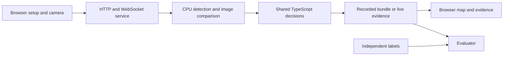

# Architecture

TurnTable has one CPU evidence pipeline and one shared decision core. Recorded
analysis, replay and live monitoring use that core with different clocks and
transport adapters.

## Responsibilities

| Area | Responsibility |
| --- | --- |
| [web/src](../web/src/) | Guided calibration, floor-plan editing, playback, live display and staff controls |
| [service](../service/) | Upload validation, saved sources, revisions, jobs, HTTP/WebSocket boundaries and worker lifecycle |
| [processor](../processor/) | Video normalization, detection, anonymous tracking, geometry, references and CPU surface measurements |
| [shared](../shared/) | Data contracts, detector categories and separately identified measurement/decision/alignment settings |
| [evaluator](../evaluator/) | Independent labels, replay scoring, evidence audit, trials and reporting |
| [tests](../tests/) | Behavioral tests and small test-only fixtures |

The replay engine and live engine share the rule core and object comparator.
They stay separate because prerecorded source time differs from live capture and
availability time. Python invokes TypeScript headless entry points for planning
and live decisions; those modules are runtime dependencies, not browser-only code.

## Coordinates and identity

Four normalized tabletop corners define a perspective transform for comparable
reference/current crops. People zones describe occupancy regions in the camera
image. Floor-plan positions, dimensions and rotation describe the schematic
display separately. A stable table ID connects these views.

Changing a display name or map position preserves physical camera geometry.
Changing a reference, inventory or camera geometry invalidates its old visual
evidence. Reference bytes, geometry, detector and measurement configuration are
hashed into approved baselines. Requests and results carry source, generation,
baseline and configuration identities so stale work cannot restore readiness.

Draft references, table proposals and edited counts do not imply approval. Saves
use source revisions. Failed saves retain user edits; conflicts reject stale
writes. Floor-plan changes invalidate map review independently of visual approval.

## Runtime and storage

The browser communicates with relative `/api` URLs and chooses WSS on HTTPS.
In the hosted configuration, Caddy authenticates the complete site before
forwarding HTTP, media and WebSocket traffic to the private application container.
All authenticated users share the same workspace.

Recordings, normalized media, saved setup photos and completed bundles persist
in the configured data directory. Live frames, transient crops and bounded event
history remain in memory; explicit setup/reference saves can persist. Camera
frames travel from the browser to the service, but no live video file is written.

Use one application replica and one Uvicorn worker. Job ownership, revisions,
compute reservations and live sessions are coordinated in-process. Persistence
supports reopening completed sources after a restart; interrupted processing is
reported rather than silently resumed.

The people detector uses a four-thread CPU session. Tabletop inference uses a
separate one-thread session and the same verified model file. Bounded queues,
capture ages, worker timeouts and generation checks prevent stalled or obsolete
work from being treated as fresh evidence.

Source media transfer uses bounded Range requests with length, Content-Range and
ETag checks. Verification can still require substantial browser memory for large
recordings. The upload ceiling is not a capacity guarantee.

Examples, test fixtures and runtime data have separate purposes. The example
folders start empty; tests do not depend on them. Models are downloaded and
verified separately. The [deployment guide](DEPLOYMENT.md) explains their mounts
and the [validation guide](VALIDATION.md) separates software evidence from real
restaurant performance.
