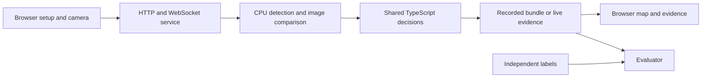

# Architecture

## Why the subscription needs near-real-time inference

The intended TurnTable subscription provides restaurant staff with a current
view of which tables are occupied, need a reset, or have enough evidence to be
ready. Its ongoing value is helping staff respond during service: notice a
departure, prioritize a table that needs cleaning, and check availability before
seating the next guests.

Inference is the model analyzing a camera image. Near-real-time inference means
repeating that analysis on fresh images throughout service and updating the
dashboard as evidence changes. An old result cannot establish whether a table
is still available now.

| What the service needs | Why it matters to the customer |
| --- | --- |
| Continuous access to fresh camera frames | Arrivals, departures and table changes can update the floor view during service. |
| A model kept loaded during each active camera session | Incoming frames can use the running inference worker without initializing it for every frame. |
| Tracking and table evidence carried across frames | A status decision can consider occupancy, vacancy and repeated tabletop checks over time. |
| Ongoing dashboard updates and freshness checks | Staff can see current evidence; stale or uncertain observations do not establish automatic readiness. |

We use the persistent EC2 service as the basis for this subscription workflow.
It maintains the camera connection, running inference workers and session state
needed for continuous monitoring. The reason for this choice is the ongoing
workload and continuity of evidence; the small model also fits in the Lambda
image used for the recording demo.

"Near-real-time" does not mean every status changes instantly. The system
deliberately waits for enough evidence to confirm arrivals, vacancy and readiness.
See [status timing](BEHAVIOR.md#people-and-tabletop-timing). Those confirmation
periods are separate from network and processing delay. Customer-facing response
time and camera capacity still need measurement before making service promises.

### What exists today and what the subscription still needs

The current live service is a prototype: it receives frames from a browser camera
session, uses one shared workspace, and permits one active analysis or camera
session per service instance. It does not yet provide customer accounts,
subscription billing or isolation between restaurants. The commercial service
also needs validated camera capacity, failure recovery and service availability.
The EC2 component is the compute foundation for that work, not a completed
multi-customer subscription platform.

### Why the demo uses Lambda

The hosted recording demo lets prospective customers try table setup, inference
and the dashboard. Its compact YOLOX Tiny model is included in the Lambda image
and processes frame batches on demand, so the demonstration does not depend on
keeping an EC2 instance online. Videos, setup and results stay in the browser tab.
It demonstrates the workflow using recordings; it does not maintain a customer's
live camera session. See [the demo rationale](STATELESS_DEPLOYMENT.md#why-the-demo-uses-lambda).

## Shared processing

TurnTable has one CPU evidence pipeline and one shared decision core. Recorded
analysis, replay and live monitoring use that core with different clocks and
transport adapters.

The [stateless recording deployment](STATELESS_DEPLOYMENT.md) adds a browser-owned
transport: decoded frames and an explicit JSON checkpoint go to a fresh Lambda
invocation; observations and the next checkpoint return to that browser. The
browser retains source media, calibration and results and runs the shared decision
core. Separate bounded assessment requests send only the table/frame pairs chosen
by that core. Python tracking, surface monitoring, rectification and reference
comparison remain shared; no cross-request server session or media store is used.

Recordings use one current format. The source kind distinguishes browser-local
media from server-processed media without selecting a different schema or policy.
Frame endpoints live under `/frames`, with no numbered API routes. Model,
configuration, build and setup identities still prevent stale evidence from being
applied to a different recording or calibration.

## Responsibilities

| Area | Responsibility |
| --- | --- |
| [web/src](../web/src/) | Guided calibration, floor-plan editing, playback, live display and staff controls |
| [service](../service/) | Upload validation, saved sources, revisions, jobs, HTTP/WebSocket boundaries and worker lifecycle |
| [processor](../processor/) | Video normalization, detection, anonymous tracking, geometry, references and CPU surface measurements |
| [shared](../shared/) | Data contracts, detector categories and separately identified measurement/decision/alignment settings |
| [evaluator](../evaluator/) | Independent labels, replay scoring, evidence audit, trials and reporting |
| [tests](../tests/) | Behavioral tests and small test-only fixtures |

The replay engine and live engine share the rule core and object comparator.
They stay separate because prerecorded source time differs from live capture and
availability time. Python invokes TypeScript headless entry points for planning
and live decisions; those modules are runtime dependencies, not browser-only code.

## Coordinates and identity

Four normalized tabletop corners define a perspective transform for comparable
reference/current crops. People zones describe occupancy regions in the camera
image. Floor-plan positions, dimensions and rotation describe the schematic
display separately. A stable table ID connects these views.

Changing a display name or map position preserves physical camera geometry.
Changing a reference, inventory or camera geometry invalidates its old visual
evidence. Reference bytes, geometry, detector and measurement configuration are
hashed into approved baselines. Requests and results carry source, generation,
baseline and configuration identities so stale work cannot restore readiness.

Draft references, table proposals and edited counts do not imply approval. Saves
use source revisions. Failed saves retain user edits; conflicts reject stale
writes. Floor-plan changes invalidate map review independently of visual approval.

## Shared-workspace runtime and storage

The browser communicates with relative `/api` URLs and chooses WSS on HTTPS.
In the EC2 configuration, Caddy authenticates the complete site before
forwarding HTTP, media and WebSocket traffic to the private application container.
All authenticated users share the same workspace.

Recordings, normalized media, saved setup photos and completed bundles persist
in the configured data directory. Live frames, transient crops and bounded event
history remain in memory; explicit setup/reference saves can persist. Camera
frames travel from the browser to the service, but no live video file is written.

Use one application replica and one Uvicorn worker. Job ownership, revisions,
compute reservations and live sessions are coordinated in-process. Persistence
supports reopening completed sources after a restart; interrupted processing is
reported rather than silently resumed.

The people detector uses a four-thread CPU session. Tabletop inference uses a
separate one-thread session and the same verified model file. Bounded queues,
capture ages, worker timeouts and generation checks prevent stalled or obsolete
work from being treated as fresh evidence.

Source media transfer uses bounded Range requests with length, Content-Range and
ETag checks. Verification can still require substantial browser memory for large
recordings. The upload ceiling is not a capacity guarantee.

Examples, test fixtures and runtime data have separate purposes. The bundled
[demo recording and clean reference](../examples/demo/) are optional user inputs;
tests do not depend on them. Only `examples/videos/` and `examples/mappings/`
start empty, for your own inputs. Models are downloaded and
verified separately. The [deployment guide](DEPLOYMENT.md) explains their mounts
and the [validation guide](VALIDATION.md) separates software evidence from real
restaurant performance.
