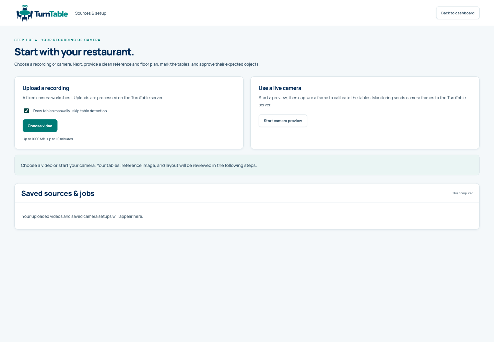
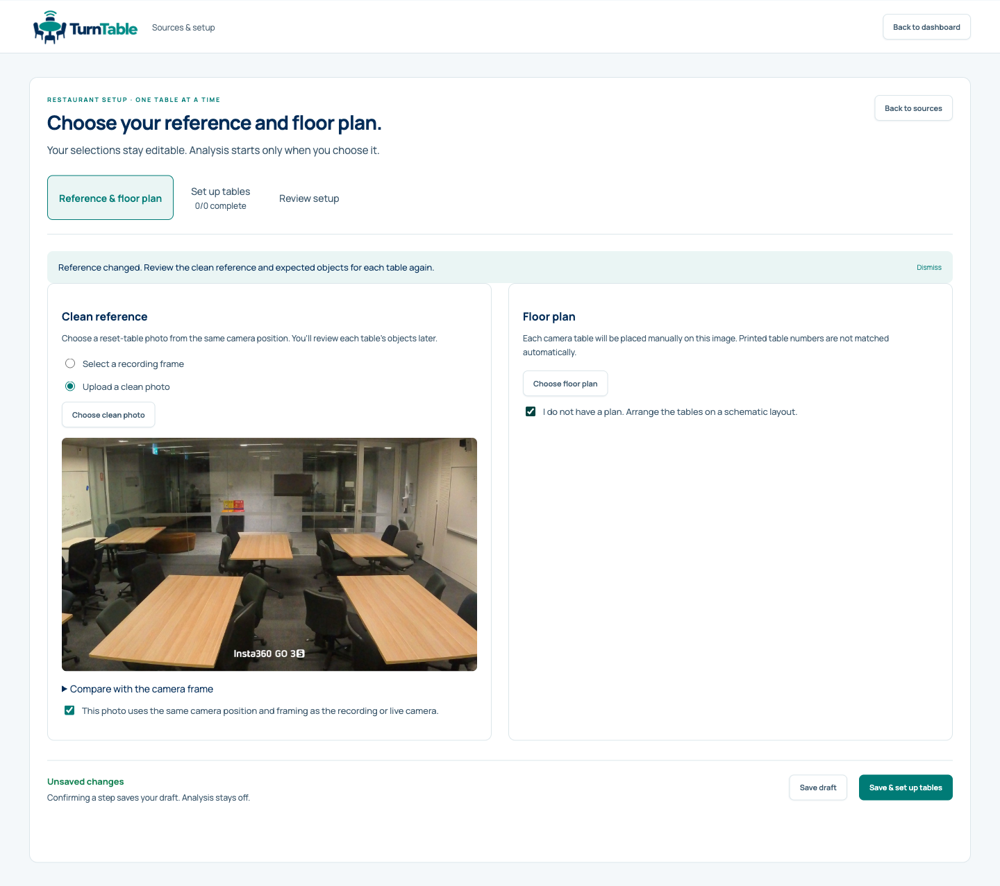
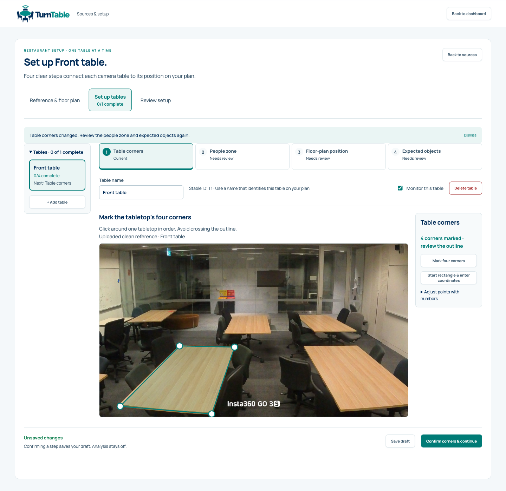
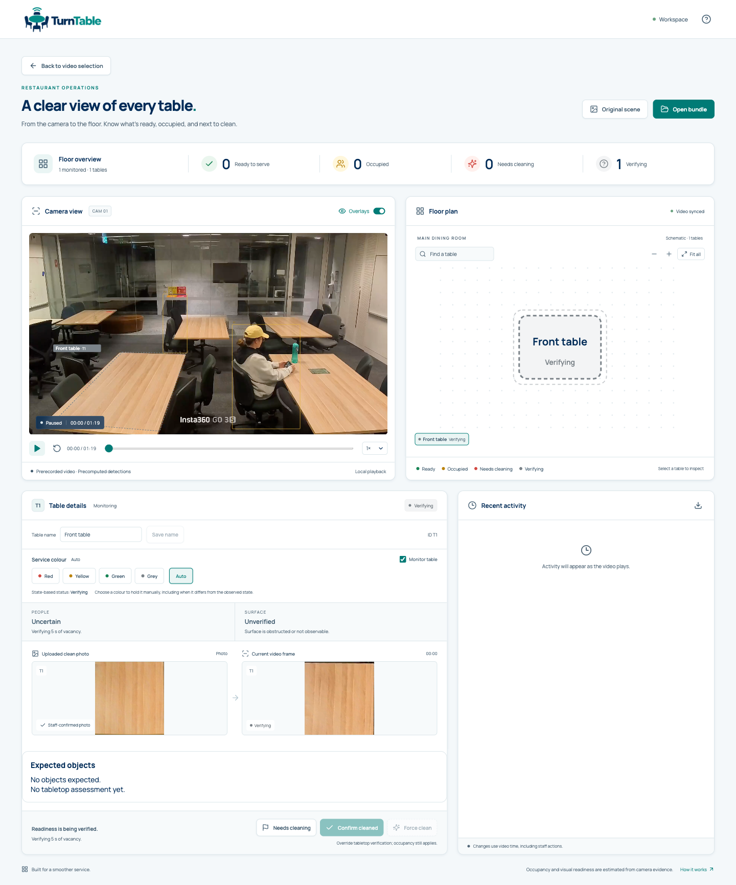

# Set up a restaurant

Start the application using the [README](../README.md#start-locally). This guide
takes you from its opening screen to an analyzed recording. For a first run, use
the bundled demo and manually mark one table; add the remaining tables once you
are comfortable with the workflow.

For an explanation of every setup section and dashboard control, use the
[screen-by-screen usage guide](USAGE.md). Its screenshots also cover the
browser-tab recording mode.

The opening screen lets you choose a recording, connect a browser camera, or
reopen a saved source. Nothing is loaded automatically. Keep the application
terminal running while you work.

## Try the demo

You need the verified Tiny model from the README and one of these included
recording/reference pairs:

| Scene | Recording to analyze | Clean reference photo |
| --- | --- | --- |
| Scene One | [scene.mp4](../examples/demo/scene.mp4) | [clean-frame.jpg](../examples/demo/clean-frame.jpg) |
| Scene Two | [scene-two.mp4](../examples/demo/scene-two.mp4) | [scene-two-clean-frame.jpg](../examples/demo/scene-two-clean-frame.jpg) |

The steps and screenshots below use Scene One, an approximately 80-second
recording of a shared study space with six tables. Scene Two is a 63-second
recording of booth seating and a freestanding table; use its matching clean
reference. Both demonstrate the application flow and have no independent
accuracy labels. There is no floor-plan image to find: choose a schematic in step 3.

### 1. Choose the recording

Under **Upload a recording**, select **Draw tables manually · skip table
detection**, click **Choose video**, and select `examples/demo/scene.mp4` from
your downloaded repository. This gives you an empty table list to work through
one table at a time. It skips automatic table proposals; object proposals and
analysis later still need the model.

For Scene Two, select `examples/demo/scene-two.mp4` instead.

Wait for upload and video preparation to finish. The reference/floor-plan editor
opens next. If it does not, see [When you cannot continue](#when-you-cannot-continue).

### 2. Select the clean reference

Choose **Upload a clean photo**, then **Choose clean photo**, and select
`examples/demo/clean-frame.jpg`. Inspect the photo and confirm **This photo uses
the same camera position and framing as the recording or live camera.**

For Scene Two, select `examples/demo/scene-two-clean-frame.jpg` instead.

A *clean reference* is the view the application compares against later. It
should show each table as you expect it after a reset. Uploading it does not
approve the objects on every table; that review happens in step 4.

### 3. Use a schematic floor plan

Select **I do not have a plan. Arrange the tables on a schematic layout.** Then
click **Save & set up tables**. A *floor plan* is the map used to display table
locations; it is separate from the camera image used for detection.

### 4. Review one table

Click **Add your first table** and give it a recognizable name, such as
`Front table`. Choose a clearly visible tabletop in the reference photo.

| Step shown in the editor | What to do | Button to save and continue |
| --- | --- | --- |
| **Table corners** | Click its four corners around the outside in order, without crossing the outline. Keep the outline on the tabletop. Drag points to correct it. | **Confirm corners & continue** |
| **People zone** | Adjust the outline to include the seats or standing area belonging to this table. Avoid aisles and neighboring tables. This region decides which people belong to the table. | **Confirm people zone & continue** |
| **Floor-plan position** | Place the named shape on the schematic. Drag, resize or rotate it to make an understandable map. This does not change the camera outline. | **Confirm position & continue** |
| **Expected objects** | Click **Propose expected objects**. Inspect the tabletop crop and detector boxes, then correct the object types and counts to match the reset reference. An empty inventory is valid if the table should have no detected objects. | **Approve objects & complete table** |

These screenshots show the local shared-workspace flow with the included demo.
The outlined table is a walkthrough example; review the geometry yourself.

Each confirmation saves that step. The app will tell you when the table is
complete. You can choose **Add another table** and repeat, or choose **Review
setup** to finish this one-table practice run. Only configured, monitored tables
appear in its results; a one-table run does not cover all six physical tables.

### 5. Finish setup and analyze

On the review screen, resolve any unfinished items, then click **Finish reviewed
setup**. This saves the setup and returns to the source screen.

Leave **Detection only** unchecked to include tabletop comparison, then click
**Analyze recording**. Keep the application running while its progress updates.
Processing time depends on the computer; the video duration is not a processing
time estimate. When processing completes, click **Open analyzed video**.

### 6. Check the result

You should see the recording, your named table on a map, playback controls, and
reference/current evidence for the selected table. Play or seek through the
recording and select the table to inspect its evidence.

Tables start **Grey · Verifying**. A table may later be yellow (occupied), red
(needs cleaning), or green (ready), depending on the footage and evidence.
Green is not required for the walkthrough to succeed. Read
[Behavior](BEHAVIOR.md) before interpreting a colour as a service decision.

To reopen a saved local recording, click **Back to video selection**, choose it in
**Saved sources & jobs**, and click **Open analyzed video** when it is complete.
The native service saves it under `data/sources/` by default.

## Other inputs and deployment modes

The hosted demo uses [stateless recording mode](STATELESS_DEPLOYMENT.md) on Lambda
and offers local video selection only. Continuous real-time camera monitoring
uses the [EC2 service](DEPLOYMENT.md) when hosted, or the native service during
local development. You can also try stateless mode locally using its deployment
guide.

Stateless mode retains setup/results in the current browser tab and sends
sampled frames for inference. There are no saved-source or camera choices, and
refreshing the page ends the session. It uses browser-decoded captures rather
than the server-normalized upload described below. The table geometry, clean
reference and explicit review requirements still apply. Use desktop Chrome or
Edge and an MP4/H.264 recording. After **Choose video**, click **Set up tables
manually**, follow the reference/table-review steps above, then choose
**Analyze video**. Results open when analysis completes; **Open results** reopens
an existing completed result. There is no server draft save or
saved-source reopening in this mode.

## Prepare your files

For your own material, select files from any folder on the computer running the
browser. The optional [examples/mappings](../examples/mappings/) folder is an
empty placeholder for your own plans. The bundled demos live in `examples/demo/`.
Files are only loaded when you select them in the application.
A floor-plan image describes table positions; it is not a clean-table reference.

Use a fixed camera with visible tabletops and people zones. A clean photo should
show the same camera position and framing as the source video. Keep a second real
recording separate if you intend to evaluate performance after tuning.

## Choose a recording or camera

Upload an MP4, MOV or WebM. The service validates and normalizes the video before
calibration. Furniture detection can suggest table positions; all proposals still
require review. Select **Draw tables manually · skip table detection** before
uploading if you want an empty table list without loading detector models.

For a browser camera, permit camera access, inspect the preview and capture a
setup frame. Only video is requested. The device belongs to the computer running
the browser, not the EC2 instance. Camera use requires localhost or HTTPS.

## Choose a clean reference and floor plan

Select a reset frame from the recording, or upload a JPG/PNG reference photo.
For an uploaded reference, explicitly confirm that the camera framing matches.
The reference is not approved merely because it was uploaded.

Upload a floor-plan image, or explicitly choose a schematic. The photograph
determines visual comparison; the plan determines how tables are displayed.

## Review one table at a time

1. **Table corners:** name the table and mark its four tabletop corners in order.
   You can draw a rectangle and refine the points. Confirm the camera geometry.
2. **People zone:** adjust and confirm the region used to associate people with
   this table. Avoid aisles and overlap with adjacent tables where possible.
3. **Floor-plan position:** position the named shape on the plan. Drag, resize,
   rotate, choose rectangle or round/oval, and optionally lock its aspect ratio.
   Numeric inputs, arrow keys and Undo/Redo provide alternatives to dragging.
4. **Expected objects:** request a proposal, inspect its crop and detector boxes,
   edit exact counts, and explicitly approve the reference and inventory.

Add any tables that detection missed. Empty expected inventories also need
approval. Unsupported items such as napkins can still be represented by the
reference photo; inventing detector categories would not make them detectable.

In the shared-workspace mode, each confirmed step saves and advances only after
the server accepts the save.
**Save draft** retains incomplete setup. Failed saves retain the editor state for
retry; a revision conflict does not overwrite newer work. Partial corner drawings
can be recovered in the same browser. Reopened draft quantities need a fresh
proposal before approval.

## Finish and start processing

**Finish reviewed setup** saves the setup. Start recorded analysis or live
monitoring separately. **Detection only** runs person monitoring and manual
controls without automatic tabletop readiness checks.

For a recording, choose **Analyze recording**, wait for completion, then
**Open analyzed video**. For a camera, start its preview and confirm that the
view still matches the saved setup before choosing **Start live monitoring**.

Saved sources can be reopened. Recorded playback includes the source video,
table map and reference/current evidence. Live monitoring sends sampled camera
frames to the service and shows the age of analyzed evidence. Stopping releases
the stream and its workers; it does not write a live video recording.

## Change a saved setup

Replacing a clean reference or changing camera polygons requires renewed visual
approval and new analysis. Replacing a floor plan requires another map-position
review while preserving valid visual evidence. Table names, rotation and map
positions do not change detector geometry or expected-object identity.

Map positions use the uploaded plan's image dimensions; schematic plans use
1000 × 650. Uploaded clean photos must match the camera aspect ratio within 1%.
Images are limited to 12 MiB and 16 megapixels. Floor plans fit within
1920 × 1080 without enlargement.

There is one current recording format and no format selector. Previously exported
numbered bundles are unsupported. Reprocess their original video through the
reviewed setup flow.

See [Behavior](BEHAVIOR.md) for what each status means and
[Reference](REFERENCE.md) for input limits and storage configuration.

## When you cannot continue

| Problem | How to continue |
| --- | --- |
| **Choose video** is disabled or the service is unavailable | Keep `npm run dev:full` running and inspect its terminal errors. Reload once the service is available. |
| The next setup button is disabled | Read the message beside it. Finish the current requirement: reference selection/alignment, schematic or plan, four corners, or a table review. **Save draft** alone does not approve a step. |
| **Propose expected objects** is disabled | Confirm the table corners, people zone and floor-plan position first. Ensure a clean reference is selected. |
| No model is available | Return to the README's model-download step and restart. Manual drawing lets you prepare geometry; it does not remove the model requirement for object proposals or analysis. |
| A clean photo is rejected | Use a JPG/PNG from the same framing and aspect ratio, at most 12 MiB and 16 megapixels. Use the clean reference supplied with the selected demo recording. |
| Saving fails or a revision conflict appears | Keep the editor open. Use **Retry save** for a failed request. For a conflict, use **Download my edits** before reopening the latest saved source and reapplying your changes. |
| Tables remain grey | Inspect the selected table's evidence and [status rules](BEHAVIOR.md). Missing approvals, people obstructing the view, uncertain measurements, or insufficient confirmation can all prevent readiness. |
| A stateless session disappeared after a refresh | Select the local recording and set it up again. That mode intentionally keeps no saved session on the server. |
