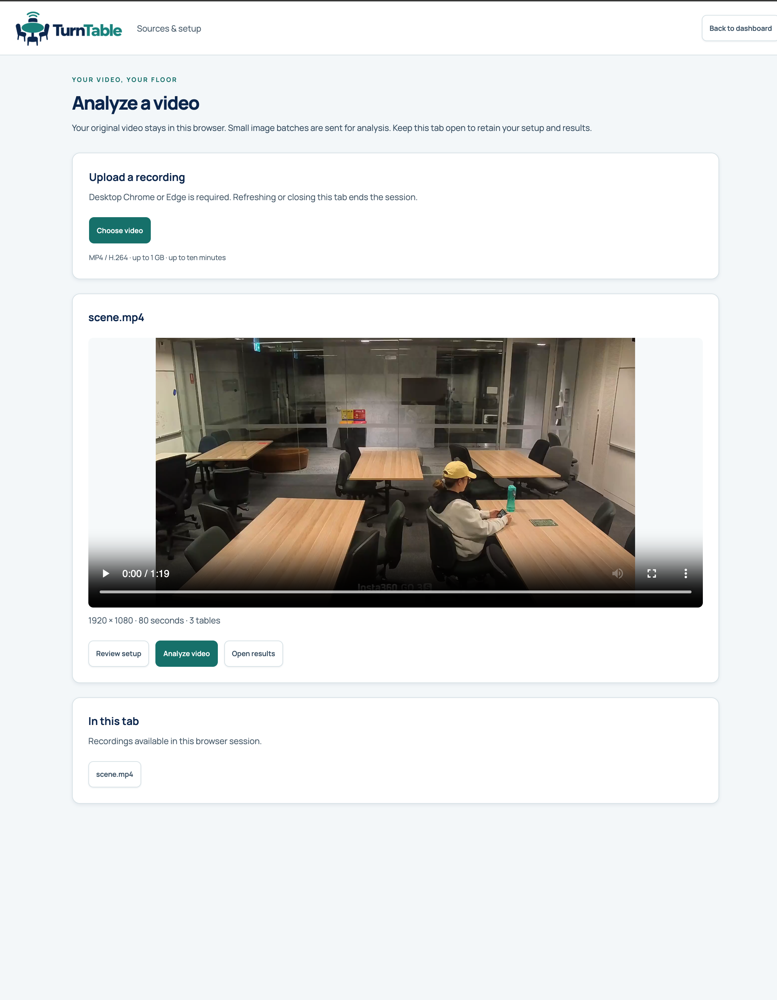
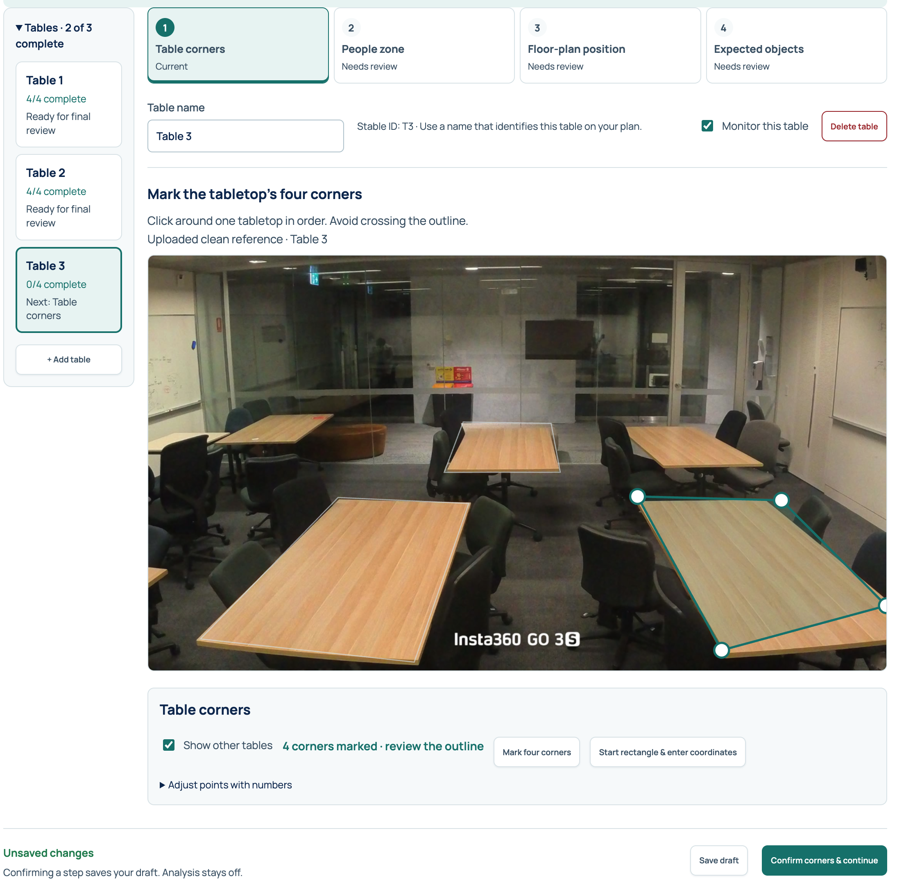
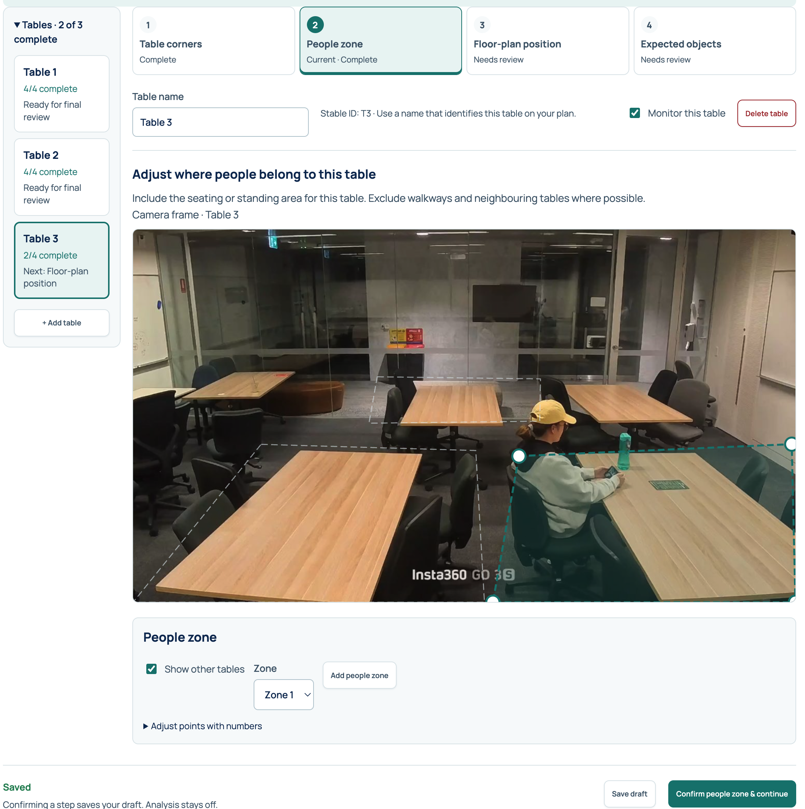
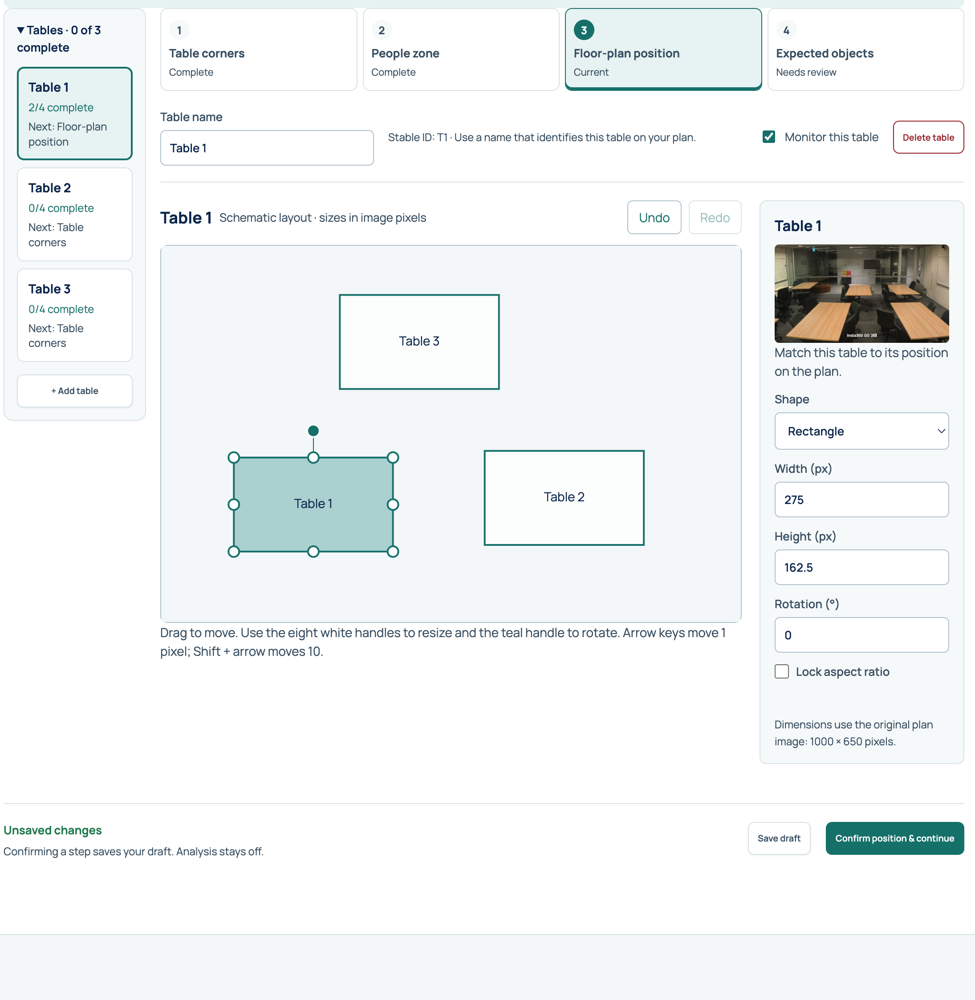
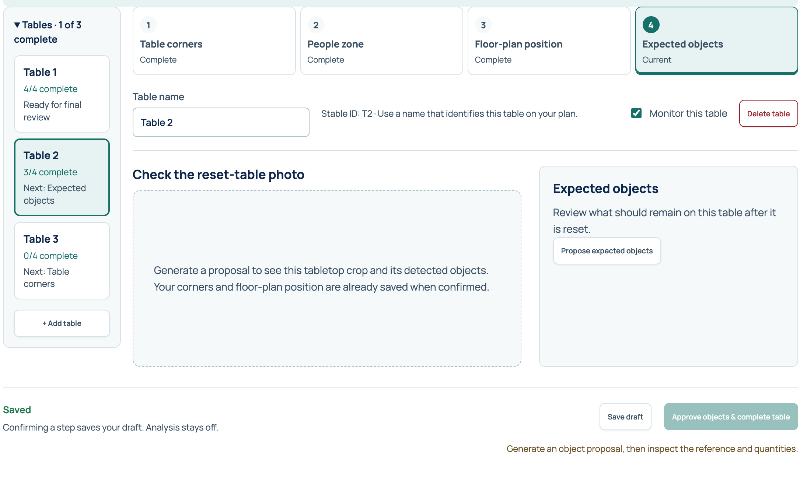
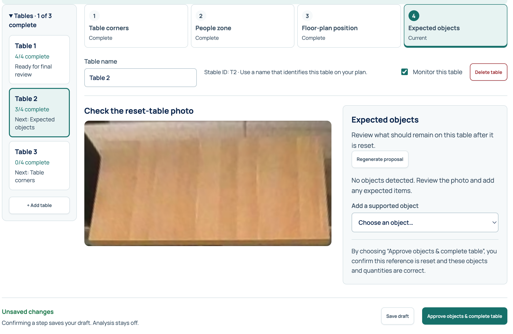
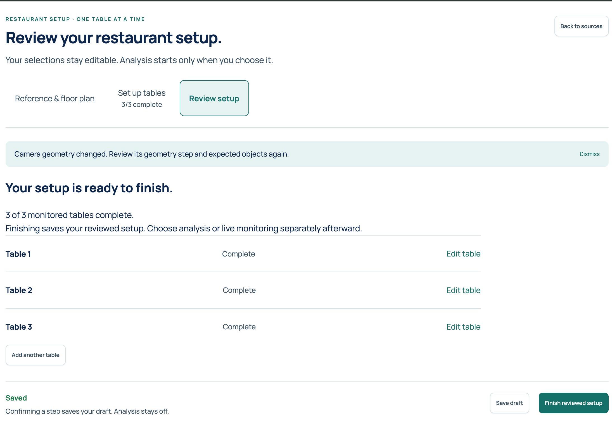
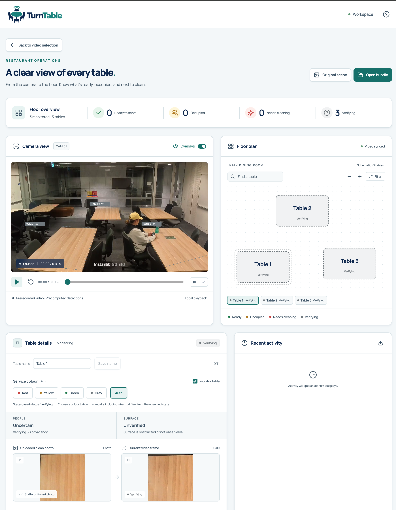

# Use TurnTable: a screen-by-screen guide

Use this guide with the application open. It explains what each section means,
what you can change, and which button takes you to the next step. For installation
and your first demo run, start with the [README](../README.md#start-locally) and
[Setup](SETUP.md#try-the-demo).

The screenshots were supplied from a three-table example. They show different
selected tables at different moments; keep your own table names matched to their
physical locations rather than copying the example numbers. An outlined table or
completed setup in a screenshot is not a recommended geometry or accuracy result.

**Reading order:** choose a video → select a reference and plan → review each
table's four steps → finish setup → analyze → use the dashboard.

| Find a screen or control | Jump to |
| --- | --- |
| Video selection, preview and recordings in this tab | [1. Choose and manage a video](#1-choose-and-manage-a-video) |
| Table list, progress, names and saving | [2. Find your way around setup](#2-find-your-way-around-setup) |
| Outline the surface to inspect | [3. Table corners](#3-table-corners) |
| Assign seating areas to a table | [4. People zone](#4-people-zone) |
| Arrange, resize and rotate the map | [5. Floor-plan position](#5-floor-plan-position) |
| Propose, correct and approve the reset inventory | [6. Expected objects](#6-expected-objects) |
| Final approval and starting analysis | [7. Review setup](#7-review-setup) |
| Playback, map, table details and activity | [8. Use the dashboard](#8-use-the-dashboard) |
| Manual colours and cleaning controls | [Choose a staff action](#choose-a-staff-action) |

## 1. Choose and manage a video

This **Analyze a video** screen is the hosted demo's browser-tab mode. The hosted
demo uses Lambda for on-demand recording analysis; continuous real-time camera
monitoring uses the [EC2 service](DEPLOYMENT.md). You can also run this demo mode
locally; see [Stateless deployment](STATELESS_DEPLOYMENT.md#run-locally).
Use desktop Chrome or Edge with an MP4/H.264 recording, up to 1 GB and ten minutes.
The original video
stays in your browser; sampled images are sent to the analysis service.

| Section or control | What it does and how to use it |
| --- | --- |
| **Upload a recording → Choose video** | Select a file from your computer. Wait for the connection and file-reading steps to finish. |
| **Video preview** | Check that you selected the correct fixed-camera recording. Play or seek using its standard video controls. Previewing alone does not run analysis. |
| **Resolution · seconds · tables** | Shows the selected recording's dimensions, duration and configured table count. The duration is not an estimate of processing time. |
| **Suggest tables** | When no tables are configured, request initial outlines. Review all proposals before analysis. |
| **Set up tables manually / Review setup** | Opens the setup editor. The label changes after tables have been added. |
| **Analyze video** | Runs analysis using the reviewed setup. It appears after setup has been finished. Results open when analysis completes. |
| **Open results** | Reopens an existing completed result without starting analysis again. It appears only when a result is available. |
| **In this tab** | Switch between recordings selected in this browser session. This is not a permanent library. |
| **Back to dashboard** | Returns to the dashboard. It does not start analysis. |

During analysis, use **Pause**, **Resume** or **Retry** as shown. **Cancel analysis**
stops the run; it does not finish the result. Keep the tab open while working.

**Saving in this mode:** video sessions, setup drafts and results last only while
this tab remains open. **Save draft** does not make them survive a page refresh.
The shared-workspace mode instead has **Saved sources & jobs**, server storage,
and camera choices; see [the mode comparison](../README.md#choose-a-deployment-when-you-need-one).

Before reviewing tables, choose a clean reference from the same camera framing
and upload a floor plan or select a schematic. These are different inputs: the
reference is used for visual comparison; the plan displays table locations.
Follow [reference and floor-plan selection](SETUP.md#2-select-the-clean-reference)
if this is your first setup.

## 2. Find your way around setup

The editor has three main sections: **Reference & floor plan**, **Set up tables**,
and **Review setup**. Within **Set up tables**, work through four steps for each
table. The screenshots below show those steps.

| Area | How to read or use it |
| --- | --- |
| **Tables** list on the left | Select the table you want to work on. The highlighted card is the active table. Expand the list if it is collapsed. |
| **2/4 complete**, **Next: …** | Counts that table's confirmed setup steps and points to its next unfinished step. |
| **Tables · 2 of 3 complete** | Two monitored tables have all four setup steps complete. It does not mean two tables are ready to serve. |
| Four step tabs | Show **Current**, **Complete** or **Needs review**. **Current · Complete** means you are viewing an already confirmed step. You can revisit steps to make corrections. |
| **Table name** | Enter a recognizable name, such as `Window table`. Use it consistently on the camera view and map. The stable ID, such as `T3`, continues to identify the same table after a rename. |
| **Monitor this table** | Includes this table in monitoring. Uncheck it to exclude it; doing so does not delete the table. |
| **+ Add table** | Adds another table to review. Missing detections do not prevent manual setup. |
| **Delete table** | Removes the selected table where supported. Browser-tab mode allows deleting saved tables; in the shared workspace, an already saved table may instead need monitoring turned off. **Undo delete** restores the most recent deletion while its notice remains; saving or confirming clears that opportunity. |
| **Unsaved changes / Saving… / Saved** | Reports whether the current edits have been saved. Wait for saving to finish before leaving. |
| **Save draft** | Keeps incomplete work without approving the current step. In browser-tab mode, the draft still ends with the session. |
| **Confirm … & continue** | Confirms the current step, saves it, then advances. Read the explanation beside a disabled button to see what is missing. |

Work on one table at a time. Changing a camera outline or expected inventory can
invalidate earlier approval; follow the updated **Needs review** labels before
finishing.

## 3. Table corners

**Purpose:** tell TurnTable which visible surface belongs to this table. These
four corners determine the tabletop image that will be compared with its clean
reference. Keep chairs, people and surrounding floor outside this outline.

1. Check the active table name. If necessary, click **Mark four corners** to draw
   a replacement outline.
2. Click four corners around the tabletop in order, clockwise or counterclockwise.
   Do not cross diagonally between opposite corners.
3. Drag the white points until the outline follows the visible tabletop edges.
4. Click **Confirm corners & continue** after reviewing all four points.

**Show other tables** displays their outlines as context. It does not enable or
disable their monitoring. Hide them if they make the selected outline hard to see.

For precise adjustments, use **Start rectangle & enter coordinates** to create
a starting shape, or expand **Adjust points with numbers**. The X/Y fields are
percentages of image width/height, from 0 to 100. Focus a corner and use arrow
keys to move by 0.1% of that image dimension; Shift moves by 1%. Starting a
rectangle replaces the current outline, so use the numeric section alone when
you only want to adjust existing points.

**Check before continuing:** the highlighted outline is on the intended tabletop,
has four non-crossing corners, and does not include a neighboring table. If a
table extends beyond the camera frame, do not invent unseen corners; use a view
that exposes the surface you want to assess.

## 4. People zone

**Purpose:** tell TurnTable which seating or standing area belongs to this table.
This region associates people with the table. It is usually broader than the
tabletop outline because it needs to include the people using the table.

1. Drag the white points around its seating or standing area.
2. Keep aisles and neighboring tables' seating outside the region where possible.
3. If seating is split into separate areas, click **Add people zone**. Use the
   **Zone** selector to choose which region you are editing. **Remove this zone**
   is available when there is more than one.
4. Click **Confirm people zone & continue**.

**Show other tables** helps you see overlap with neighboring zones. **Adjust
points with numbers** uses the same percentage coordinates as table corners.
The seated person in the screenshot illustrates the kind of area to include;
draw a region for the seating, rather than tightly tracing that person's body.

**Check before continuing:** someone sitting at this table falls inside its zone,
while a person simply walking past or sitting at the next table is excluded as
far as the camera view allows.

## 5. Floor-plan position

**Purpose:** place this same table on the map that staff will use. This changes
its display location, not the camera outline or the people zone.

| Control | How to use it |
| --- | --- |
| Table shape on the canvas | Select and drag it to the matching position on the plan. Check the name and camera thumbnail so you move the right table. |
| Eight white handles | Drag to resize the selected shape. |
| Teal handle above the shape | Drag to rotate it. |
| **Shape** | Choose a rectangle or round/oval table. |
| **Width (px), Height (px)** | Enter dimensions in plan-image pixels. These are not centimeters or real-world measurements. The schematic uses 1000 × 650 pixels. |
| **Rotation (°)** | Enter the angle in degrees. |
| **Lock aspect ratio** | Keeps width and height in proportion while resizing. |
| **Undo / Redo** | Reverses or reapplies recent map edits for the selected table. This is not an undo history for the whole setup. |
| Arrow keys | With the map focused, move the selected table by one plan-image pixel; Shift + arrow moves ten. |

Keep the entire shape inside the plan. If a size or rotation is rejected, move
the table inward or reduce its dimensions. Make the arrangement recognizable,
then click **Confirm position & continue**. Printed table numbers in an uploaded
plan are not matched automatically.

## 6. Expected objects

**Purpose:** define what should remain on this table after it has been reset.
This is the reference inventory, not a list of everything currently visible in
the recording.

Before a proposal, the image area is a placeholder and approval is disabled.
Click **Propose expected objects** after confirming the first three steps. Wait
for the tabletop crop and proposed inventory to appear.

1. Inspect the crop. It should show the intended tabletop in its reset condition.
   If it shows the wrong surface or includes unrelated furniture, correct the
   corners or reference before approving.
2. Review the proposed objects and quantities. Add missing supported types with
   **Add a supported object**, correct counts, and remove unwanted entries.
3. Use **Regenerate proposal** if you need a fresh suggestion. Review it again
   before approving.
4. Click **Approve objects & complete table** to confirm both the reset reference
   and its inventory.

**“No objects detected” needs your review.** For a table that should be bare, an
empty inventory is appropriate. If it should retain two cups, add `cup` with a
count of `2`, even if the proposal missed them. Only add supported categories;
the clean photo can still represent unsupported details such as napkins.

A table with all four steps confirmed shows **4/4 complete**. Choose **Add another
table** or select the next table from the list, then repeat. A saved but unapproved
inventory draft can require a new proposal when reopened.

## 7. Review setup

**Purpose:** check that every monitored table has a complete setup before analysis.

| What you see | What to do |
| --- | --- |
| **Your setup is ready to finish** | Check the table list, names and completion count. |
| An unfinished requirement | Select it or click **Edit table** to complete the missing review. |
| **Add another table** | Return to setup if a table is missing. |
| **Finish reviewed setup** | Save the reviewed setup and return to the video-selection screen. This does not start processing. |

The **Camera geometry changed…** banner can remain after an earlier outline edit,
even once the required reviews are complete. It is a notice about that edit, not
by itself evidence that the physical camera moved. Check the current step labels,
completion list and enabled finish button; dismiss the old notice after reviewing.

After finishing, choose **Analyze video**. Wait for processing to complete and the
results to open. Later, **Open results** reopens them. Saving setup changes in
browser-tab mode invalidates the earlier processed result; analyze again after
reviewing the changes. In the shared-workspace mode, the equivalent buttons are
**Analyze recording** and **Open analyzed video**.

## 8. Use the dashboard

### Floor overview

The summary counts monitored tables by their currently displayed service colour:
**Ready to serve**, **Occupied**, **Needs cleaning**, or **Verifying**. Counts can
include manual colour overrides. Tables with monitoring off are excluded.

Grey at the beginning is expected: setup approval does not itself establish
readiness. The screenshot is paused at `00:00`, so all three tables are still
verifying. Press Play and inspect the evidence as the recording advances.

### Camera view and playback

| Control or indicator | How to use it |
| --- | --- |
| **Play / Pause** | Advance or pause the recorded video and its synchronized table states. |
| Timeline and time label | Seek to a moment in the recording. Table states and visible evidence follow the video time. |
| Speed selector | Change viewing speed from 0.5× to 3×. Timing rules still use source/video seconds. |
| **Restart** (circular-arrow button) | Return to time zero, paused, and clear staff actions added in this playback session. Seek on the timeline instead if you only want to revisit a moment. |
| **Overlays** | Show or hide table outlines, labels and person boxes on the video. Click a table outline to select it. Hiding overlays does not turn off detection. |
| **Prerecorded video / Local playback** | Indicates recorded analysis being replayed, not a live camera feed. |

### Floor plan

Click a table on the map or in the list beneath it to select it. **Table details**
then shows that table's evidence and controls. Selecting a table from the list
also centers it in the map. Use **Find a table** to filter the list by name or ID;
the search does not hide the other shapes on the map.

Drag to pan, use **− / +** to zoom and **Fit all** to bring the tables back into
view. The dashboard map is for inspection. To change its saved arrangement, return to
**Review setup → Floor-plan position**.

### Table details and evidence

| Section | What it tells you or lets you do |
| --- | --- |
| **Table name → Save name** | Enter a unique name of 1–40 characters, then save or press Enter. Its stable ID and camera geometry remain the same. |
| **Service colour** | Shows whether the displayed colour is automatic or manually overridden. |
| **State-based status** | Shows the status derived from the underlying evidence, including when you have chosen a different manual colour. |
| **Monitor table** | Exclude or include this table in active totals and video overlays. It remains selectable on the floor plan. Toggling clears this playback session's staff actions for that table. Re-enabling recalculates its status from the recording's existing evidence. |
| **People** | Shows occupancy state and its reason, such as arrival pending, occupied, departure pending, vacant or uncertain. |
| **Surface** | Shows whether the tabletop is cleared/reset, needs reset or remains unverified, with an explanation. |
| **Uploaded clean photo / Original reference** | The approved reference crop for this table. |
| **Current video frame** | The crop at the current playback time. It is not necessarily the frame used for the last measured assessment. |
| **Expected objects** and assessment details | Shows the reset inventory and available comparison evidence. Read the measurement's timestamp and explanation; a percentage alone does not determine the current status. |

If **No tabletop assessment yet** appears, no applicable measurement is available
at that point. If the surface is obstructed, an approved clean photo alone is not
enough to make the table ready. Review both **People** and **Surface**, then use
[Behavior](BEHAVIOR.md) for the exact timing and evidence rules.

### Choose a staff action

For normal inspection, leave **Auto** selected. On a recorded video, staff actions
are placed at the current playback timestamp. They do not change what physically
happened in the footage.

| Control | Meaning |
| --- | --- |
| **Red / Yellow / Green / Grey** | Holds that displayed colour manually until another colour, **Auto** or **Restart**, even if the evidence indicates something else. **Manual override** identifies this state. |
| **Auto** | Clears the manual colour override and returns display control to the evidence rules. |
| **Needs cleaning** | Records a staff cleaning/reset requirement. This differs from simply holding the display red. |
| **Confirm cleaned** | Records staff confirmation when stable vacancy and usable visibility allow it. It is disabled when the required evidence is missing. |
| **Force clean** | Bypasses tabletop verification after stable valid vacancy. It still cannot bypass occupied, pending or uncertain people evidence, and it records a staff override. |

**Green** and **Force clean** are different controls: Green forces the displayed
colour; Force clean remains constrained by occupancy. A manually green table is
not proof that automatic readiness checks passed. **Auto** clears the manual
colour choice; it is not a general undo for every staff event. Cleaning actions
do not automatically remove a held colour; choose **Auto** to release it.

### Recent activity and export

**Recent activity** shows the latest four replay events with table ID, explanation
and video timestamp. An empty list at the start is normal. Seeking backward
recomputes the displayed replay state; it does not delete the session's timestamped
staff actions.

The download icon exports `turntable-replay-events.json`, containing the available
replay events, staff events and monitoring context. This is an event record, not
a video, a complete analyzed bundle, or a backup that can restore a closed tab.

### Header and navigation

| Control | What it does |
| --- | --- |
| **Back to video selection** | Returns to the recording page to switch videos or review setup. In browser-tab mode, use **In this tab** to reopen a selected recording. |
| **Original scene** | Opens the full reference/setup image for context beyond the selected tabletop crop. It is disabled if no full image is available; a video-frame-only reference in browser-tab mode may not supply one. |
| **Open bundle** | Imports an existing complete analyzed bundle folder and its assets. For a raw MP4, return to video selection and use **Choose video**. This button does not export the current result. |
| **? / How it works** | Opens the in-app explanation of status and evidence. |

For a first inspection: press Play, select a table, read its **People** and
**Surface** explanations, compare the images, and check **Recent activity**.
Return to setup if the geometry or reference is wrong, then analyze again.
